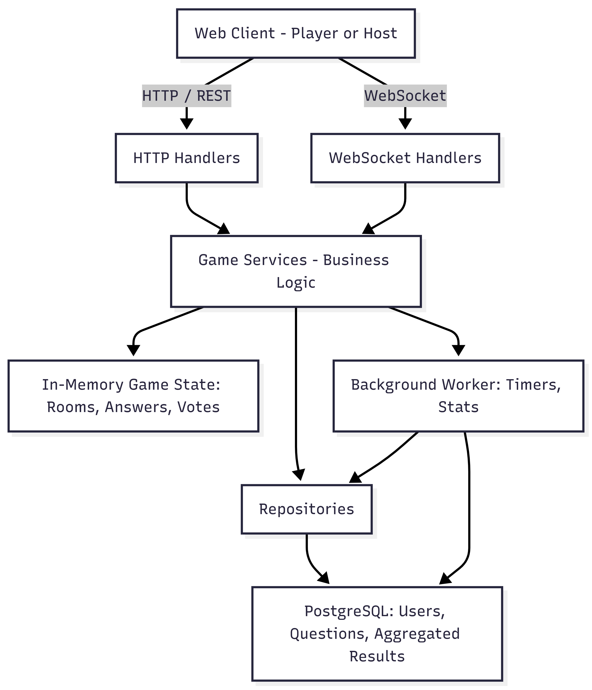

# Jack Like

## 1. Короткое описание домена

Проект представляет собой онлайн-игру в формате **Jackbox-like**, реализующую один текстовый игровой режим с участием нескольких игроков в реальном времени.

Один пользователь (**Host**) создаёт игровую комнату и запускает игру, после чего другие пользователи (**Players**) подключаются к комнате по короткому коду.

Игра проходит в несколько стадий:

1. Ожидание игроков  
2. Ввод текстовых ответов на вопрос  
3. Голосование за лучшие ответы  
4. Отображение результатов  

Система ориентирована на **короткоживущие игровые сессии**, где текущее состояние игры (комнаты, ответы, голоса, таймеры) хранится **в памяти сервера** для минимальной задержки и упрощения синхронизации.

Долговременные данные — пользователи, роли, вопросы и агрегированные результаты игр — сохраняются в **PostgreSQL**.

## Ограничения и предположения

- Потеря состояния активной игры при перезапуске сервера допустима  
- Система не рассчитана на горизонтальное масштабирование  
- Клиентская часть — минимальный web-интерфейс (HTML/JS)  
- Реалтайм-взаимодействие реализуется через **WebSocket**

## 2. Роли пользователей

| Роль   | Описание                                           |
|--------|--------------------------------------------------|
| Admin  | Управляет вопросами игры, имеет доступ к статистике |
| Host   | Создаёт игровую комнату и управляет ходом игры   |
| Player | Подключается к комнате, отвечает на вопросы и голосует |

## 3. Значимые use cases (ключевые сценарии)

### UC-1. Создание игровой комнаты
**As a Host**, I want to create a game room so that players can join the game using a room code.

- Host аутентифицирован  
- Создаётся новая игровая комната  
- Генерируется уникальный короткий код комнаты  
- Комната переходит в состояние **lobby**

### UC-2. Подключение игрока к комнате
**As a Player**, I want to join a room using a code so that I can participate in the game.

- Player вводит код комнаты  
- Система проверяет существование комнаты  
- Player добавляется в список участников  
- Player получает доступ к **WebSocket-каналу** комнаты

### UC-3. Запуск игры
**As a Host**, I want to start the game so that the round can begin.

- Комната находится в состоянии **lobby**  
- Минимальное количество игроков подключено  
- Система выбирает вопрос  
- Игра переходит в состояние **answering**  
- Запускается таймер раунда

### UC-4. Отправка ответа игроком
**As a Player**, I want to submit an answer within the time limit so that I can compete with other players.

- Player подключён к комнате  
- Комната находится в состоянии **answering**  
- Ответ принимается и сохраняется в памяти  
- Повторная отправка ответа запрещена

### UC-5. Голосование за ответы
**As a Player**, I want to vote for the best answer so that the winner can be determined.

- Комната находится в состоянии **voting**  
- Player голосует за ответ другого игрока  
- Один игрок может проголосовать только один раз  
- Голосование за собственный ответ запрещено

### UC-6. Завершение раунда и подсчёт результатов
**As a System**, I want to automatically finish the round and calculate results so that the game can continue.

- Таймер раунда истёк  
- Система подсчитывает голоса  
- Формируется таблица результатов  
- Результаты отправляются всем участникам комнаты  
- Агрегированные данные сохраняются в **БД**

